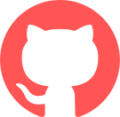
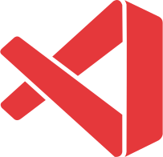

# Hi!
## I'm Aidan, also known as Zetvue. I am a musician, designer and (very) novice web dev.

### Languages I know or am learning

### Tools I use

## Other stuff I do
### I make music!

You can listen to my tracks on [YouTube][youtube], [Bandcamp][bandcamp], [SoundCloud][soundcloud], or [Spotify][spotify].

### I also do design.

Notable examples of my design work are my own logo, icons for [SkyClient][skyclient] and various other logos for other people, such as [Deftu][deftu] and [NotToxic][nottoxic].

For other media I am on, visit [my website][website].

[youtube]: https://youtube.com/c/Zetvue
[bandcamp]: https://zetvue.bandcamp.com
[soundcloud]: https://soundcloud.com/zetvue
[spotify]: https://open.spotify.com/artist/7o8JZ8DuQ9uCEpq5xM8C8K

[skyclient]: https://skyclient.co
[deftu]: https://github.com/Deftu
[nottoxic]: https://github.com/nottoxicdev

[website]: https://zetvue.carrd.co
